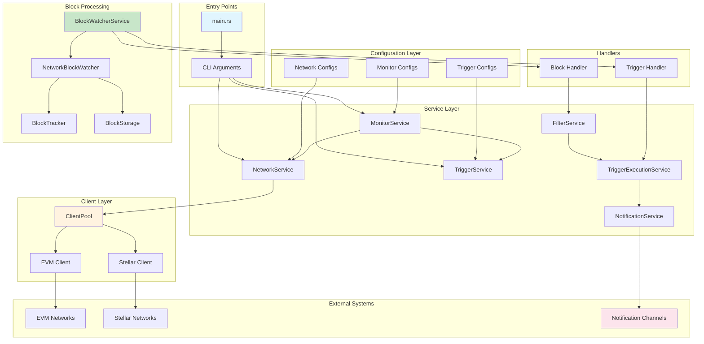
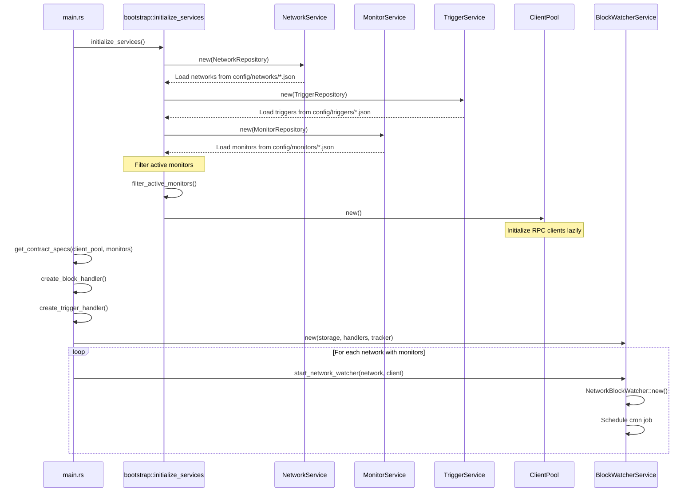
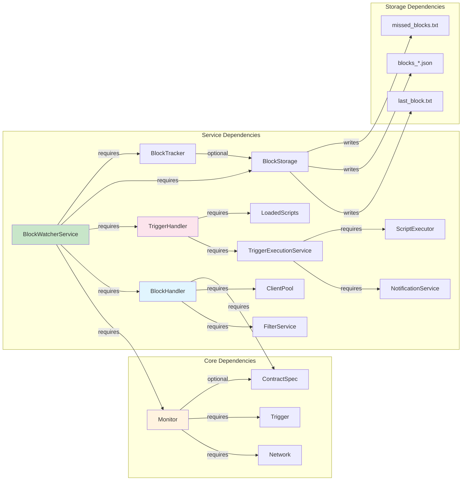
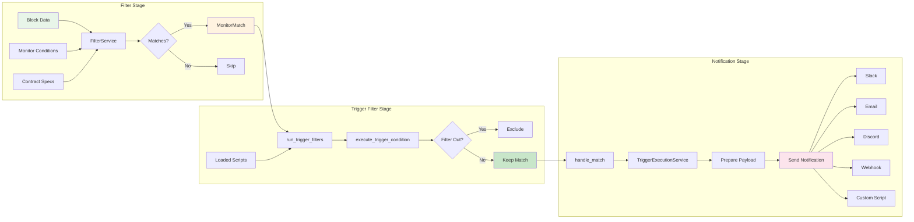
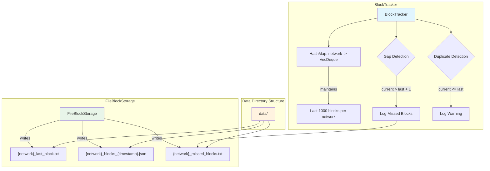
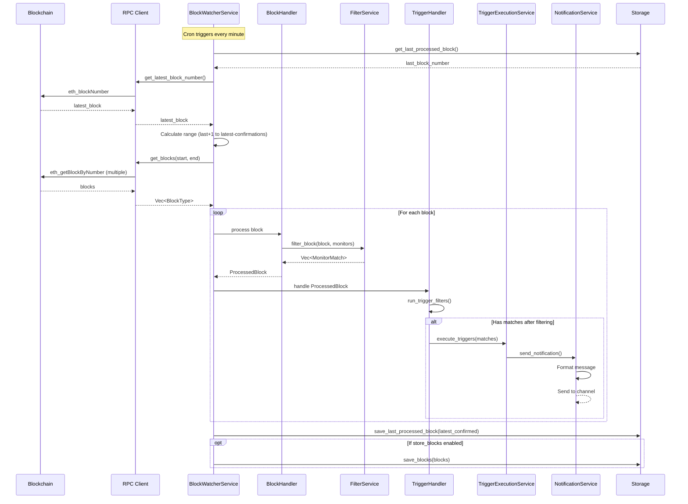
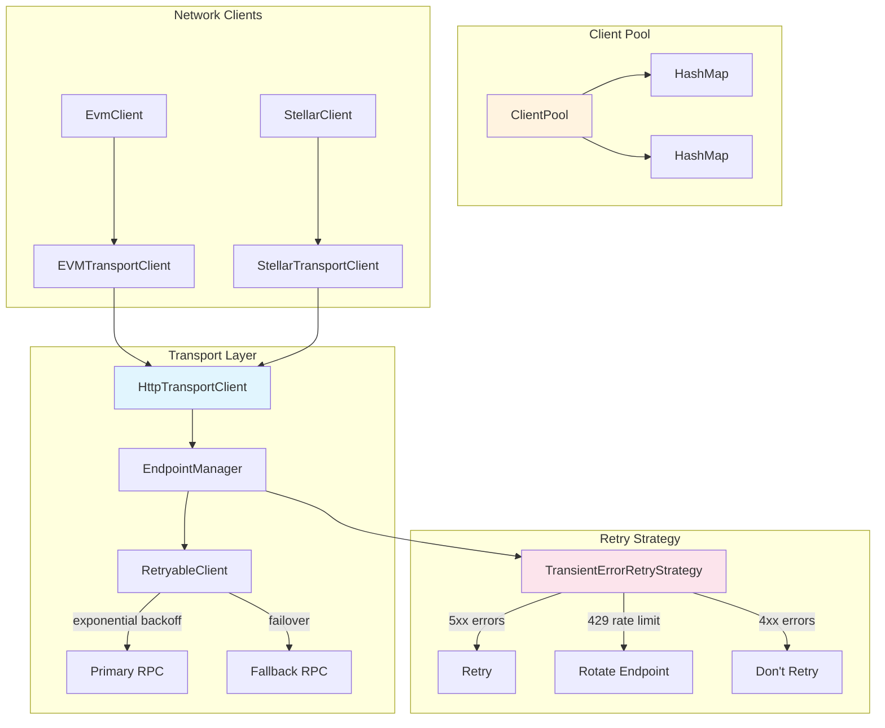

# OpenZeppelin Monitor BlockWatcher Architecture

## Table of Contents

1. [Overview](#overview)
2. [High-Level Architecture](#high-level-architecture)
3. [Initialization Flow](#initialization-flow)
4. [Component Dependencies](#component-dependencies)
5. [Block Processing Pipeline](#block-processing-pipeline)
6. [Network Watcher Lifecycle](#network-watcher-lifecycle)
7. [Filter and Trigger Flow](#filter-and-trigger-flow)
8. [Storage and Tracking](#storage-and-tracking)
9. [End-to-End Data Flow](#end-to-end-data-flow)
10. [RPC Client Architecture](#rpc-client-architecture)

## Overview

The OpenZeppelin Monitor BlockWatcher is a sophisticated blockchain monitoring system that watches multiple networks concurrently, processes blocks according to configured monitors, and triggers notifications based on matched conditions. The system is built with Rust and uses an async, event-driven architecture.

## High-Level Architecture



## Initialization Flow



## Component Dependencies



## Block Processing Pipeline

```mermaid
flowchart TD
    START[Cron Trigger] --> PNB[process_new_blocks]
    
    PNB --> GETLAST[Get Last Processed Block]
    GETLAST --> GETLATEST[Get Latest Block from RPC]
    
    GETLATEST --> CALC[Calculate Block Range]
    CALC --> |"start_block to latest_confirmed"| FETCH[Fetch Blocks]
    
    FETCH --> PIPELINE[Create Processing Pipeline]
    
    PIPELINE --> CH1[Channel 1: process_tx/rx]
    PIPELINE --> CH2[Channel 2: trigger_tx/rx]
    
    subgraph "Stage 1: Block Processing"
        CH1 --> RECORD[Record Block in Tracker]
        RECORD --> SEND1[Send to process_tx]
        SEND1 --> CONCURRENT[Concurrent Processing]
        CONCURRENT --> |"buffer_unordered(32)"| HANDLER[block_handler()]
        HANDLER --> PROCESSED[ProcessedBlock]
    end
    
    subgraph "Stage 2: Trigger Pipeline"
        PROCESSED --> SEND2[Send to trigger_tx]
        SEND2 --> BTREE[BTreeMap for Ordering]
        BTREE --> ORDERED[Process in Order]
        ORDERED --> TRIGGER[trigger_handler()]
        TRIGGER --> NOTIFY[Spawn Notification Task]
    end
    
    subgraph "Stage 3: Persistence"
        NOTIFY --> STORE{store_blocks?}
        STORE -->|Yes| DELETE[Delete Old Blocks]
        DELETE --> SAVE[Save New Blocks]
        STORE -->|No| UPDATE
        SAVE --> UPDATE[Update Last Processed]
    end
    
    UPDATE --> END[Complete]
    
    style START fill:#e8f5e9
    style PIPELINE fill:#e1f5fe
    style TRIGGER fill:#fce4ec
    style END fill:#c8e6c9
```

## Network Watcher Lifecycle

```mermaid
stateDiagram-v2
    [*] --> Created: NetworkBlockWatcher::new()
    
    Created --> Initialized: watcher.start(rpc_client)
    
    Initialized --> Scheduled: JobScheduler.add(Job)
    
    Scheduled --> Running: scheduler.start()
    
    Running --> Processing: Cron trigger
    Processing --> Running: Complete
    
    Running --> Stopping: stop_network_watcher()
    
    Stopping --> Shutdown: scheduler.shutdown()
    
    Shutdown --> [*]
    
    Processing --> Error: RPC failure
    Error --> Processing: Retry with backoff
    
    note right of Processing
        process_new_blocks():
        1. Get last processed block
        2. Fetch new blocks
        3. Process through pipeline
        4. Update storage
    end note
    
    note right of Running
        Executes on cron schedule:
        - Every minute (*/1 * * * *)
        - Or custom schedule
    end note
```

## Filter and Trigger Flow



## Storage and Tracking



## End-to-End Data Flow



## RPC Client Architecture



## Key Configuration Parameters

### Network Configuration

- **cron_schedule**: When to check for new blocks (e.g., `"*/1 * * * *"` for every minute)
- **confirmation_blocks**: How many blocks to wait before considering a block confirmed
- **max_past_blocks**: Maximum number of historical blocks to process (auto-calculated if not set)
- **store_blocks**: Whether to persist block data to disk
- **block_time_ms**: Expected time between blocks (used for calculations)

### Monitor Configuration

- **networks**: Which networks this monitor applies to
- **addresses**: Contract addresses to monitor
- **match_conditions**: Events, functions, and transaction conditions to match
- **trigger_conditions**: Scripts to filter matches before triggering
- **triggers**: Notification configurations to execute

### Processing Constants

- **Buffer size**: 32 concurrent blocks processed at once
- **Channel buffer**: 2x block count for pipeline channels
- **History size**: 1000 blocks kept in memory per network
- **Retry base**: 1 second exponential backoff for RPC retries

## Critical Dependencies

1. **BlockWatcher CANNOT run without**:
   - At least one active (non-paused) monitor
   - Network configuration for monitored networks
   - RPC endpoints accessible and responding

2. **Processing REQUIRES**:
   - Sequential block processing (no gaps)
   - Ordered trigger execution
   - Persistent storage for recovery

3. **Performance Bottlenecks**:
   - RPC response time
   - Contract spec fetching (cached after first fetch)
   - Script execution for trigger filters
   - Notification service delivery

## Python Integration Strategy

To run only the blockwatcher components from Python:

1. **Create minimal monitor configuration**:
   - Monitor all blocks (empty match conditions)
   - Apply to desired networks
   - No trigger conditions

2. **Create empty trigger configuration**:
   - No notification endpoints
   - Prevents any alerts

3. **Run the Rust binary**:
   - Use subprocess to execute `./openzeppelin-monitor`
   - Monitor stdout/stderr for logs
   - Watch `data/` directory for processing status

4. **Provide control interface**:
   - Start/stop monitoring
   - Check processing status
   - View last processed blocks
   - Detect missed blocks

This approach leverages the production-tested Rust implementation while providing a focused blockwatcher interface.
